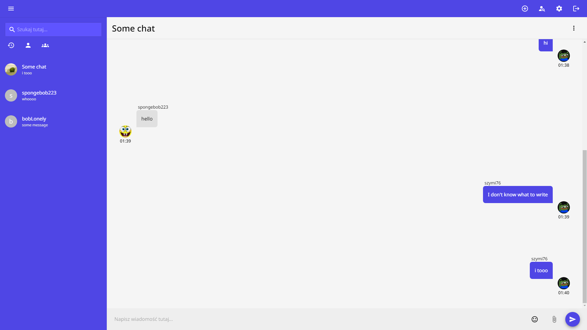

<div align="center">
  <a href="https://sendit-9i5p.onrender.com">
    
  </a>

  <h3 align="center">Sendit</h3>
  <p align="center">
    Prosta aplikacja do komunikowania się za pomocą czatu.
  </p>
</div>

## O projekcie

[](https://sendit-9i5p.onrender.com)

Aplikacja umożliwia:
* Tworzenie czatów grupowych
* Pisanie w czatach indywidualnych i grupowych
* Zarządzaniem użytkownikami w czacie 

### Zbudowana za pomocą

This section should list any major frameworks/libraries used to bootstrap your project. Leave any add-ons/plugins for the acknowledgements section. Here are a few examples.

* 
* 
* 
* 
* 
* 
* 

### Instalacja

1. Pobranie wymaganych bibliotek.

```sh
   npm install
```

2. Utworznie projektu firebase. [Tutaj](https://console.firebase.google.com/) możesz go utworzyć.

2. Uzupełnienie pliku `.env` ze wcześniej utworzonego projektu.

4. Wystartowanie serwera.

```sh
   npm run dev
```


